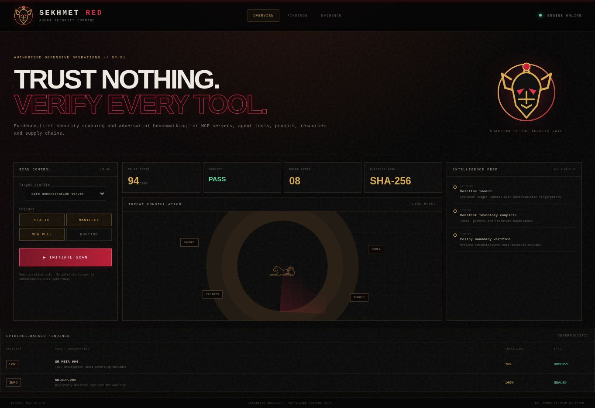

[Launch the live SEKHMET RED interface](https://eldoctorams.github.io/Sekhmet-red/)

<div align="center">


# SEKHMET RED



### Trust nothing. Verify every tool.

Evidence-first security scanning and adversarial benchmarking for MCP servers, AI agent tools, prompts, resources and supply chains.

[](https://github.com/eldoctorams/sekhmet-red/actions/workflows/ci.yml)
[](pyproject.toml)
[](LICENSE)
[](SECURITY.md)

</div>

## The agentic gate has a guardian

MCP servers and AI agent tools create a powerful new trust boundary. A polished tool description can conceal instruction overrides, excessive privileges, unsafe execution, secret exfiltration or a supply-chain change introduced after approval. **SEKHMET RED** turns those risks into reproducible, evidence-backed findings before deployment.

The first alpha contains a working offline scanner, deterministic fingerprints, baseline comparison for rug-pull detection, JSON and SARIF output, safe fixtures, CI gates and an interactive command interface.

## What works today

- Static inspection of source, manifests, prompts, resources and tool metadata.
- Detection rules for prompt injection, secret exfiltration, hardcoded credentials, dynamic execution, broad filesystem access, unrestricted egress, floating packages and unsafe deserialization.
- Stable SHA-256 target digests and finding fingerprints.
- Baseline comparison that identifies new, resolved and unchanged findings.
- CI-friendly exit codes with configurable severity threshold.
- JSON evidence bundles and SARIF 2.1.0 for GitHub code scanning.
- Safe vulnerable and secure fixtures with no real target interaction.
- Cinematic local/static command interface in [`web/`](web/).

## Quick start

```bash
git clone https://github.com/eldoctorams/sekhmet-red.git
cd sekhmet-red
python -m pip install -e .

sekhmet scan ./tests/fixtures/secure
sekhmet scan ./your-mcp-server --json report.json --sarif report.sarif
```

Fail CI on a selected threshold:

```bash
sekhmet scan . --fail-on high
```

Detect security drift or a potential rug pull:

```bash
sekhmet scan ./server --json approved-baseline.json --fail-on never
sekhmet scan ./server --baseline approved-baseline.json
```

## Architecture

```text
Target → File inventory → Deterministic rules → Evidence fingerprints
                                      ├── JSON evidence bundle
                                      ├── SARIF security report
                                      └── Baseline drift verdict
```

The alpha intentionally keeps its core engine dependency-free. No scanned content is sent to an external LLM or API. Optional runtime adapters and additional analyzers will remain isolated behind explicit operator consent.

## Research lineage

SEKHMET RED is an original implementation informed by strong open-source work:

- [Cisco AI Defense MCP Scanner](https://github.com/cisco-ai-defense/mcp-scanner) — multi-engine MCP inspection, Apache-2.0.
- [Tencent AI-Infra-Guard](https://github.com/Tencent/AI-Infra-Guard) — broad AI security coverage and operational presentation, Apache-2.0.
- [AgentDojo](https://github.com/ethz-spylab/agentdojo) — dynamic prompt-injection evaluation methodology, MIT.

No source code from these projects is vendored in this alpha. See [reference analysis](docs/REFERENCE_PROJECTS.md).

## Responsible use

SEKHMET RED is for defensive research and systems you own or are explicitly authorized to test. The included fixtures are synthetic. Do not aim future runtime harnesses at third-party infrastructure without written authorization. See [SECURITY.md](SECURITY.md).

## Author

**Dr. Ahmed Mohamed El Sayed**<br>
OSINT · Digital Forensics · Cybercrime Investigation · Financial Crime Intelligence · AI-Powered Investigation Systems

[Website](https://drahmedelsayed.com/) · [LinkedIn](https://www.linkedin.com/in/eldoctorams/) · [GitHub](https://github.com/eldoctorams)
